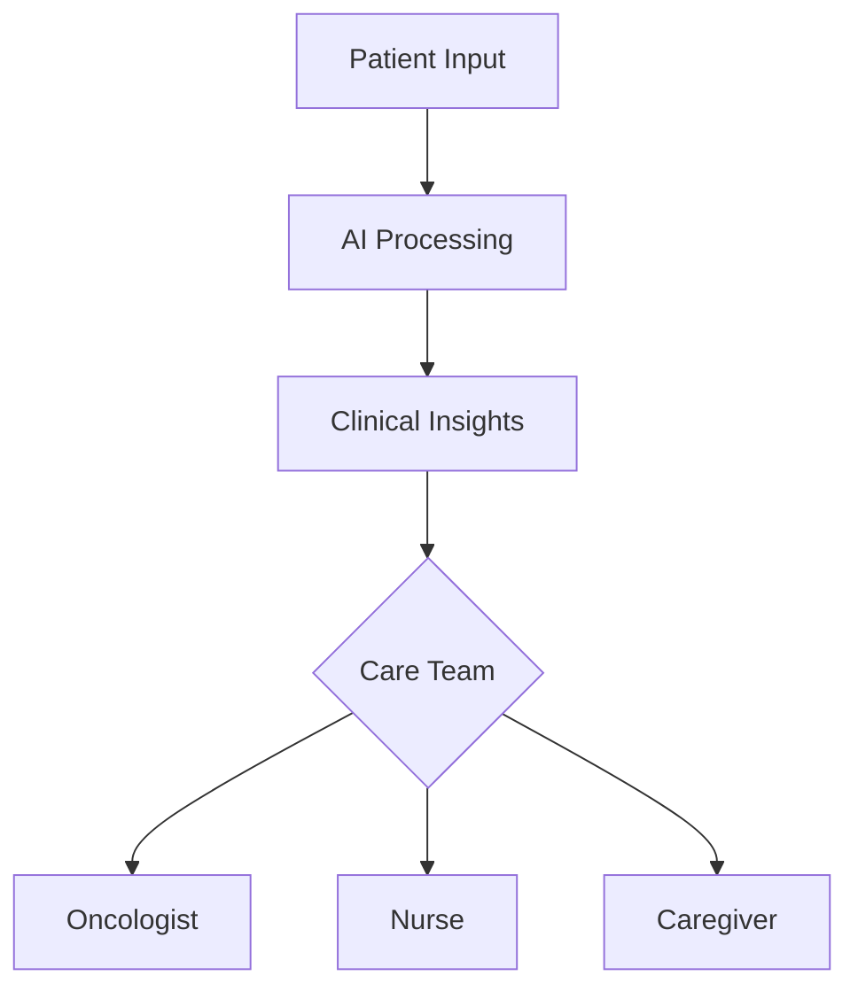

# OncoLog 🩺📱  
*Empowering Cancer Journeys Through AI-Powered Tracking*  
[](https://www.hhs.gov/hipaa)  
*Building AI course project - [Elements of AI](https://buildingai.elementsofai.com/)*  

  
*AI-enhanced symptom tracking interface (Sample visualization)*

## Summary  
OncoLog revolutionizes cancer care management by combining:  
📋 **Digital Symptom Logging** + 🧠 **AI Analysis** → 🏥 **Personalized Care Insights**  
A secure platform enabling patients and caregivers to collaboratively track treatment progress while maintaining seamless communication with medical teams.

## How is it used?  
**3-Pillar System**:  
1. **Patient Input**  
   - 📱 Mobile app for real-time symptom scoring (CTCAE standards)  
   - 💊 Medication adherence tracking with computer vision  
2. **AI Analysis**  
   - 🔍 Pattern detection in treatment responses  
   - 🚨 Early warning system for adverse events  
3. **Care Coordination**  
   - 👨⚕️ Automated report generation for oncology teams  
   - 👪 Family portal for shared caregiving  



## Data Sources & AI Methods  
### Health Data Integration  
| Source | Data Type | Frequency | Privacy Level |  
|--------|-----------|-----------|--------------|  
| EHR Systems | Treatment Plans | Real-time | HIPAA Grade |  
| Wearables | Vital Signs | Continuous | Encrypted |  
| User Input | PROs (Patient-Reported Outcomes) | Daily | Anonymized |  

### AI Architecture  
```python
class OncologyAssistant(nn.Module):
    def __init__(self):
        super().__init__()
        self.symptom_analyzer = BERT()              # NLP for symptom descriptions
        self.treatment_mapper = GNN()               # Drug interaction modeling
        self.risk_predictor = Transformer()         # Adverse event forecasting
        
    def forward(self, inputs):
        symptom_embed = self.symptom_analyzer(inputs['notes'])
        drug_graph = self.treatment_mapper(inputs['meds'])
        return self.risk_predictor(symptom_embed, drug_graph)
```

## What's Next?  
**Phase 1 Roadmap**  
1. 🧬 Genomic integration for personalized therapy tracking  
2. 🌐 Multi-language support for global accessibility  
3. 🕶️ AR visualization of treatment progress  

**Clinical Partnerships**  
- 🏥 Integration with Epic/Cerner EHR systems  
- 🔬 Collaboration with NCI Cancer Centers  
- 📊 Real-world evidence generation for FDA submissions  

## Acknowledgments  
- **Reaktor** & **University of Helsinki** - Building AI curriculum  
- **NVIDIA Clara** - Medical AI framework support  
- **Patient Advocacy Groups** - User experience insights 💜  
